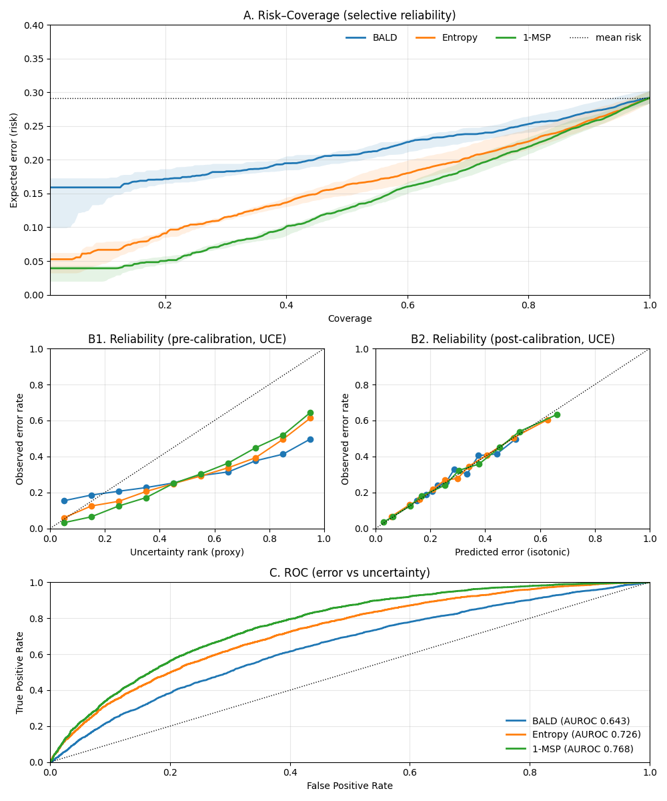
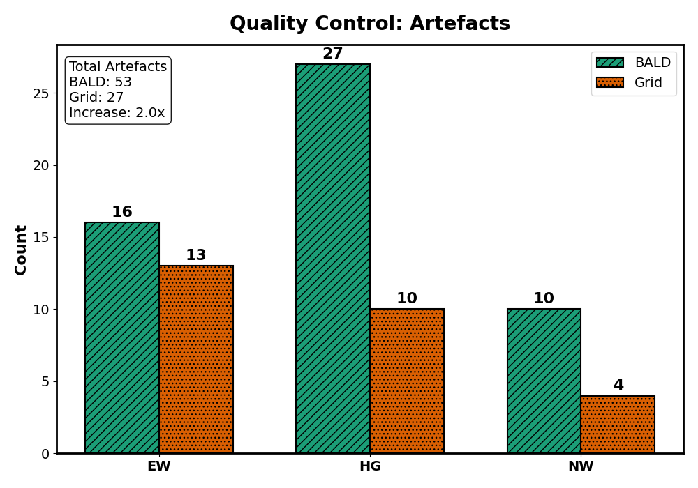

# Uncertainty-aware Smart Labelling Tool and U-Net Suite

## Overview
This repository provides a comprehensive pipeline for low-budget Active Learning (AL) in histopathology. It consists of two major components designed to bridge the gap between high-computational Deep Learning requirements and responsive clinical annotation tools:

1.  **Deep Learning Suite** – A TensorFlow-based training and inference engine utilizing **U-Nets with Concrete Dropout** and **Group Normalization**. It is designed to estimate epistemic uncertainty (via BALD) and total uncertainty (via $1-\text{MSP}$) for high-resolution medical image analysis.
2.  **Smart Labelling System (SLT)** – A PyQt5 application that utilises an "Offline" Active Learning workflow. It allows pathologists to annotate clusters of uncertainty-weighted points without requiring real-time GPU inference, using a pre-computed memory bank.

**Note:** This project is not production-ready and remains a proof of concept. Software behaviour may change between versions.


## Key Technical Features

### 1. Uncertainty-Aware U-Net Architecture
Unlike standard implementations, this suite addresses specific challenges in histopathological uncertainty quantification:
* **Concrete Dropout:** Replaces standard MC Dropout. This allows the model to learn dropout probabilities ($p$) and weight regularisation data-drivenly via variational optimisation, rather than relying on fixed hyperparameters.
* **Group Normalization:** Replaces Batch Normalization. This is critical for epistemic uncertainty estimation; it avoids batch-statistic coupling that distorts uncertainty estimates during stochastic forward passes and enables stable training with effective batch sizes of 1.

### 2. The "Offline" Active Learning Workflow
To bypass the computational bottleneck of running Bayesian inference live during annotation, the SLT separates inference from interaction:
* **Memory Bank:** Inference generates predictions, feature embeddings, and BALD scores, which are serialised into a compressed HDF5/SQLite bank.
* **Dynamic Attenuation:** As users annotate, the system applies a heuristic distance-based attenuation rule to update the informativeness of neighbouring points in the feature space without model retraining:
    $$u^{(t+1)}(x) = u^{(t)}(x) \cdot \left( 1 - \exp\left(-\lambda \cdot d(x, x^*)^2 \right) \right)$$
* **Coreset Selection:** Integrates $k$-Center Greedy Farthest-First Traversal to ensure candidate batches are diverse in feature space, preventing redundancy in annotation.

## Empirical Validation & Performance

This system was validated on a multi-centre Colorectal Cancer (CRC) cohort (CLASICC dataset), assessing both the *quality* of uncertainty estimates and their *utility* in active learning.

### Quantitative Analysis: Risk & Calibration
We evaluated three uncertainty metrics: **BALD** (Epistemic), **Entropy**, and **1-MSP** (Total Uncertainty).



**Key Findings from Figure A-C:**
* **Selective Prediction (Panel A):** The Risk-Coverage curves show that **1-MSP (Green)** achieves the lowest selective risk. If you sort predictions by confidence and reject the most uncertain ones, 1-MSP yields the fewest remaining errors.
* **Calibration (Panel B1-B2):** Raw uncertainty scores (B1) are rarely probabilistic. Our pipeline uses **ECDF-Transfer + Isotonic Regression** to calibrate these scores. Panel B2 shows the result: a near-perfect alignment between *predicted risk* and *observed error*, crucial for clinical trust.
* **Error Detection (Panel C):** 1-MSP outperforms BALD in pure error detection (AUROC **0.768** vs **0.643**). This confirms that **Total Uncertainty** is best for triage, while **Epistemic Uncertainty** (BALD) serves a different purpose (see below).

### Uncertainty Quantification (QC vs. Adaptation)
Experiments demonstrated a distinct "division of labour" between uncertainty metrics:
* **Error Triage:** $1-\text{MSP}$ (Maximum Softmax Probability) provided the strongest discrimination for selective prediction (AUROC **0.761**).
* **Quality Control (QC):** Epistemic uncertainty (BALD) proved superior for detecting Out-of-Distribution (OOD) data. The SLT's uncertainty-guided mode detected **1.96x** more artefacts (tissue folds, debris, blur) compared to random sampling.




### Qualitative Analysis: What does "Uncertainty" look like?
Does high model uncertainty actually correspond to difficult data? We visualised patches with the lowest and highest **BALD** (Epistemic Uncertainty) scores to validate the model's behaviour.


* **Low Uncertainty (Top Row):** Corresponds to canonical, well-stained glandular structures. The model is confident because the data closely resembles the training distribution.
* **High Uncertainty (Bottom Row):** The model correctly assigns high uncertainty to **artefacts** (tissue folds, debris), **poor staining**, or **ambiguous morphology**.
* **Implication:** This evidences that BALD is an effective metric for **Quality Control (QC)** and **Out-of-Distribution (OOD)** detection, capable of flagging unusable data before it affects clinical analysis.

### Low-Budget Domain Adaptation
In "cold start" scenarios (limited annotation budget, $N \approx 400$ points), we compared Uncertainty Sampling against Random Sampling using a Rehearsal (Old + New data) fine-tuning schedule.

| Strategy | Kappa ($\kappa$) | F1 Weighted | Findings |
| :--- | :--- | :--- | :--- |
| **Random Subset + Rehearsal** | **0.60 ± 0.03** | **0.78 ± 0.02** | Most effective for initial "Phase 1" representation learning. |
| **Uncertainty (BALD) + Rehearsal** | 0.56 ± 0.02 | 0.76 ± 0.02 | Effective for identifying errors, but less effective for stabilising features in early adaptation. |
| **Full Supervision (Upper Bound)** | 0.60 ± 0.03 | 0.78 ± 0.02 | Random sampling of a complete set of points from CLASICC as upper bound of performance. |

**Key Insight:** For low-budget adaptation, establishing feature coverage (via Random/Typicality sampling) is more effective than refining decision boundaries (via Uncertainty) in the early stages. However, Uncertainty is essential for safety and artefact removal.

## Getting Started

### Environment

Install the dependencies with Conda:

```bash
conda env create -f environment.yml

```

Activate the environment with `conda activate SLT`.

### Training a Model

Edit `configurations/configuration.yaml` to match your dataset. Start training with:

```bash
python DeepLearning/training/main.py --config configurations/configuration.yaml

```

Checkpoints and logs will be written to the directory specified in the configuration file.

### Running Inference

The scripts under `DeepLearning/inference/` generate prediction logits and uncertainty measures that the GUI can read. See `main_infer.py` for a minimal example.

### Launching the Smart Labelling Tool

Run the GUI from the repository root:

```bash
python gui_main.py

```

A start-up dialogue allows you to continue a previous session, load an existing project, or create a new one from a predictions database. Label clusters of points and export the results when finished.

### Building the Executable (Windows)

To create a standalone `.exe` file for distribution to clinicians who do not have Python installed:

1. Ensure **PyInstaller** is installed in your environment (`pip install pyinstaller`).
2. Run the provided batch script (renamed to `.bat` for Windows compatibility):
```cmd
build_exe.bat

```


3. The output file `SmartLabellingTool.exe` will be generated in the `dist/` folder.

## User Guide

### Suggested Workflow

1. **Label Crops:** Label every visible crop using the class-number shortcuts (0--8) or the buttons in the control panel.
2. **Manual Locking:** Right-click individual patches to label and "lock" them. This prevents bulk actions from overriding your decision. Locked patches are highlighted with a black border.
3. **Agree with Model:** Press `Space` to agree with the remaining model predictions. This action will only affect patches that have not been manually locked.
4. **Auto-Advance:** If enabled, the tool automatically jumps to the next recommended cluster after pressing `Agree`.
5. **Navigation:** You may manually click **Go to next recommended** once the current cluster is fully assessed.
6. **Backtracking:** Use `Backspace` if you need to revisit the previous cluster.
7. **Repeat:** Continue until no clusters remain or the target coverage is reached.

### Class-Number Mapping (Histopathology)

| Key | Class Name | Description |
| --- | --- | --- |
| **0** | Non-Informative | Background, adipose tissue, or unclassifiable |
| **1** | Tumour | Lands on a tumour cell |
| **2** | Stroma | Fibroblast, collagen, fibrosis, or stromal compartment |
| **3** | Necrosis | Area of definite necrosis |
| **4** | Vessel | Blood or lymphatic vessel |
| **5** | Inflammation | Inflammation, multinucleate giant cell, neutrophils |
| **6** | Tumour-Lumen | Lumen of a tumour gland |
| **7** | Mucin | Extracellular mucin |
| **8** | Muscle | Smooth or skeletal muscle |
| **A** | Artefact | Blur, fold, out-of-focus, debris, pen mark, etc. |
| **U** | Unsure | Request second scoring for this point |

**Mnemonic:** Keys follow the numeric row; class names appear on the corresponding GUI buttons in the control panel on the right for reference.

**Annotation Notes:**

* **Tumour-Lumen:** Applies to points within a gland's lumen surrounded by tumour cells. If the lumen contains necrotic debris or mucin, code based on the material (3 or 7), not as lumen.
* **Inflammation:** Assign '5' for well-defined lymphocyte foci, neutrophilic infiltrates, or giant cells. Scattered background lymphocytes in stroma should be scored as Stroma ('2').

### Essential Shortcuts

| Action | Key | Notes |
| --- | --- | --- |
| Assign Class | `0` ... `8` | See mapping table above. |
| Agree | `Space` | Skips manually locked crops. |
| Force Agree | `Ctrl` + `Space` | Overwrites manual labels. |
| Unlabel | `-` | Removes label & restores original uncertainty. |
| Mark Unsure | `U` | Flag for later review. |
| Mark Artefact | `A` | Flags debris, folds, or blur. |
| Next Cluster | Enter/Return | Navigate to the next recommended batch. |
| Previous Cluster | Left Arrow | Navigate back one batch. |
| Zoom | `Ctrl` + `Scroll` | Or use the slider in the panel. |
| Toggle Overlays | `H` | Toggle annotation visibility on/off. |
